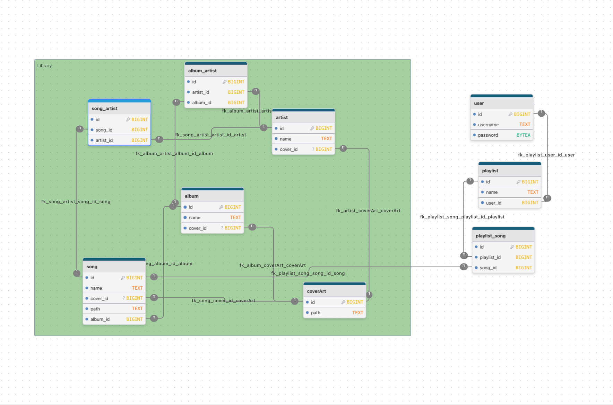

# Spotify Clone

This is my work for my polytechnic school. I have chosen Spotify, because I enjoy listening to the music all the time. And also I host my own instance of [Navidrome] (self hosted music server) with music I own, and it follows [OpenSubsonic] API specification.

So, I can follow [the specification][OpenSubsonic], and potentially my clone application could be used with other [OpenSubsonic]-compliant servers. *(there are [a lot](https://github.com/awesome-selfhosted/awesome-selfhosted#media-streaming---audio-streaming))*

Since the main point of the given task was to learn database relationships, repository also includes [a barebone database diagram](./database-diagram.jpeg) to prove my knowledge in relationships.


## Want to try out?
For a limited time I host a public instance at <https://spotify.p1ka.eu> on my server. It is connected to [Navidrome demo server instance](https://www.navidrome.org/demo/). Feel free to try it out.

P.S. To create a playlist, go to [the demo server](https://www.navidrome.org/demo/), and create there. Sorry, I haven't wrote UI to create a playlist 😭

## Summary of learned experience.
My main goal was to deep dive into frontend development, to understand how everything works from ground up and why we have current ecosystem as it is. And it was very fun, and too much time was taken, while looking back not much from a glance was done 😄.

Most fun was figuring out how to work with [Audio API](https://developer.mozilla.org/en-US/docs/Web/API/HTMLAudioElement) and [Media Session API](https://developer.mozilla.org/en-US/docs/Web/API/Media_Session_API). I actually wrote everything via React Hooks, so it integrates into the ecosystem. Must not be the best approach, but it was fun. [Here it is btw](./src/components/player/SongAudio.tsx)

I haven't created basic components like buttons and checkboxes, most of the styles could be reused, like with icon buttons for example. But nonetheless I think application end up great judging by my unexperience with frontend. If I had more reason to continue the project, I would totally do it, and would refactor components to be more reusable.

To sum everything up, I am very proud with this learning experience, and how the project end up. It was fun to tinker on a deep level with React, probably because everything for me is new stuff.

## Run the project
1. Make sure that you have a [NodeJS](https://nodejs.org/en) installed.
2. Create an `.env` file with these values
```toml
# Use Navidrome demo server
VITE_SUBSONIC_URL = https://demo.navidrome.org
VITE_SUBSONIC_USER = demo
VITE_SUBSONIC_PASS = demo
```
Project does not have authentication system, so all credentials are hardcoded via env variables.
3. Install packages
```bash
npm i
```
4. Run development server
```bash
npm run dev
```
5. To build static files, use `build` script
```bash
npm run build
```
And in the `dist/` folder will reside an `index.html` file with `assets/` folder that contains javascript, css and images.

If you are gonna use static files, don't forget to setup SPA file serving. Example for [Caddy](https://caddyserver.com/)
```ini
spotify.example.com {
    root /path/to/dist
    file_server
    try_files {path} /index.html # try_files is important, since it will be used when a file from the path hasn't been found
}
```

## Stack
* Build system - [Vite](https://vite.dev/)
* UI framework - React v19
* Router - [Tanstack Router]
* State managment - [Tanstack Query] + [Zustand]
* OpenSubsonic API - [written from scratch](./src/lib/api/subsonic/)
* Data validation - [Zod](https://zod.dev/)
* Styligg - Plain CSS with [CSS Modules](https://vite.dev/guide/features#css-modules)
* Icons - [Lucide](https://lucide.dev/)
* Table managment - [Tanstack Table](https://tanstack.com/table/latest)
* *[and etc](#other-packages-used)*

### Why React?
React has probably biggest ecosystem, and I know basics of its rendering. So it was chosen because of popularity and familiarity. And it is fun to try and write optimized React code, which does not redraw entire megabuild of a page when one tiny bitty state changes 😒

### Why two state managment libraries?
When I was working at the beginning of my internship, I have noticed that with [React.StrictMode](https://react.dev/reference/react/StrictMode) fetch requests are sent **two times**, which is expected since StrictMode renders tree two times.

I searched for a solution, and found [Tanstack Query], which is very powerful tool. It automatically deduplicates requests, caches data, optimistically refetches requests and can act as a state managment library, since you can manually set cached data.

It is a literally **godsend** library! Thanks to it, there is no need for realtime updates via websocket, and creating complex system to propagate updates across entire app. If you have a state from a server, you can use this library, and you won't need to use another state managment library.

Since OpenSubsonic API is used, most of the stuff is on the server, so most of the things is stored via [Tanstack Query]

But what about [Zustand]? It is actually used only for player state, you can [take a look here](./src/lib/state.ts), it is pretty simple. And also stored in local storage, so you can continue from where you left. 

To repeat, [Zustand] is only used to control client-side state, aka player state. For everything else, aka server state, [Tanstack Query] used.

There is also [Tanstack Store](https://tanstack.com/store/latest), but at the current moment it is in alpha, and [Zustand] is very easy to use for its purpose. So it was decided to not to experiment.

### Why Tanstack Router?
During my internship first time I actually have chosen [React Router](https://reactrouter.com/), since it is very old and famous library, and I heard developers learnt their experience from [Remix](https://v2.remix.run/), and used it in React Router v7 framework mode.

Both Library and Framework modes were used in two different projects, latter was used in latest project. It was okay at the beginning, but framework mode was mode more for SSR rendering, but I prefer static files, since for me server resources are sacred, especially with current hardware price increases due to AI demands. And it does not work great in SPA mode. It actually builds a SSR server, and then deletes it from build artifacts *(yikes)*. And also pre-render gave headaches, React Router expected components to be renderable on the server by default, because of that DOM wasn't always available... 

Bla-bla-bla. So, we already were using [Tanstack Query], and I found out that they also have [Tanstack Router] library. And these guys are amazing.
1. It integrates seamlessly into Vite, no need to use [dedicated cli build system](https://reactrouter.com/api/other-api/dev)
2. API is pretty simple, especially with File routes. And even while you run Vite dev server, creating or renaming new routes, will automatically have all boilerplate code you'll need (it is actually not much, like 9 lines with page component). It felt like there was a special IDE integration!
3. First class Typescript support. All link components, route params, search query params and even data loading is typesafe. You have changed a route? Not a problem, Typescript will tell you there you need to change something. And types are generated into [routeTree.gen.ts](./src/routeTree.gen.ts) file, so even without dev server you'll have full typesafety.
4. Built in data fetching and caching. I have integration album, artist and playlist pages with [Tanstack Query], and when user only thinks about clicking on an album, all data is already preloaded before he even clicks on the link.
5. It is very lightweight (12kb), yet very powerful

I swear, this Tanstack team revolutionize web development experience. Huge kudos to them for amazing libraries.

### Other packages used
* [clsx](https://www.npmjs.com/package/clsx) to simplify className concatination (used heavily in tailwind based projects)
* [node-vibrant](https://vibrant.dev/) to generate a pallete of colors from images, currently used for background gradients at album, playlist and artist pages.
* [sass-embedded](https://www.npmjs.com/package/sass-embedded) used initially, but modern css already has most features you would want, so it was abandoned later
* [spark-md5](https://www.npmjs.com/package/spark-md5) to generate a hash from given password (yup, opensubsonic uses md5 hashing for password. Alternative is api keys, but they aren't supported widely, like nowhere)
* [biome](https://biomejs.dev/) fast and smart formatter and linter, was provided with project template. Actually great
* [react-aria-components](https://react-aria.adobe.com/) are Adobe headless components that follow Aria. It was actually hard to understand everything at once, so I dropped RAC in favor of components from scratch, just in sake of learning how to style, and understand bases.
* [Tanstack Form](https://tanstack.com/form/latest) was used at the beginning alongside with RAC, but I understood that it takes too much time to create a login page for me, so I decided to focus more on main player functionality, not usual components. 

## Disclaimer
The project presented herein is an independent, non‑commercial school assignment created solely for educational purposes. It is **not** affiliated with, endorsed by, or sponsored by **Spotify AB** or any of its affiliates. All trademarks, service marks, logos, and other intellectual property rights displayed in this project (including but not limited to the “Spotify” name and the Spotify logo) are the exclusive property of **Spotify AB**.

The use of Spotify’s visual assets, branding elements, or any other copyrighted material in this project is intended solely for illustrative, academic, and non‑profit purposes. No portion of this project may be reproduced, distributed, or used for commercial gain without the explicit written permission of **Spotify AB**.

By viewing or using this project, you acknowledge and agree that Spotify retains all rights to its trademarks and related intellectual property, and that this project does not claim any ownership or official relationship with Spotify.


[Navidrome]: https://www.navidrome.org/
[OpenSubsonic]: https://opensubsonic.netlify.app/
[Tanstack Router]: https://tanstack.com/router/latest
[Tanstack Query]: https://tanstack.com/query/latest
[Zustand]: https://github.com/pmndrs/zustand
